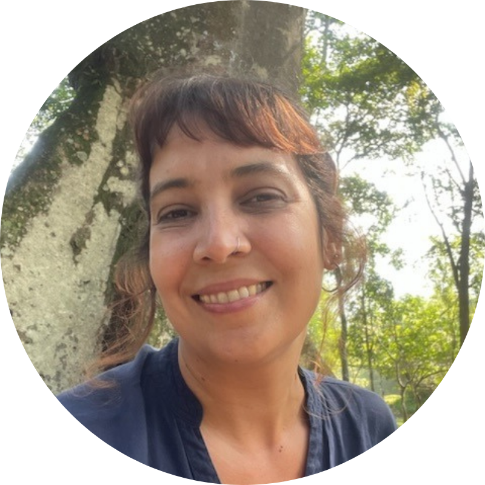
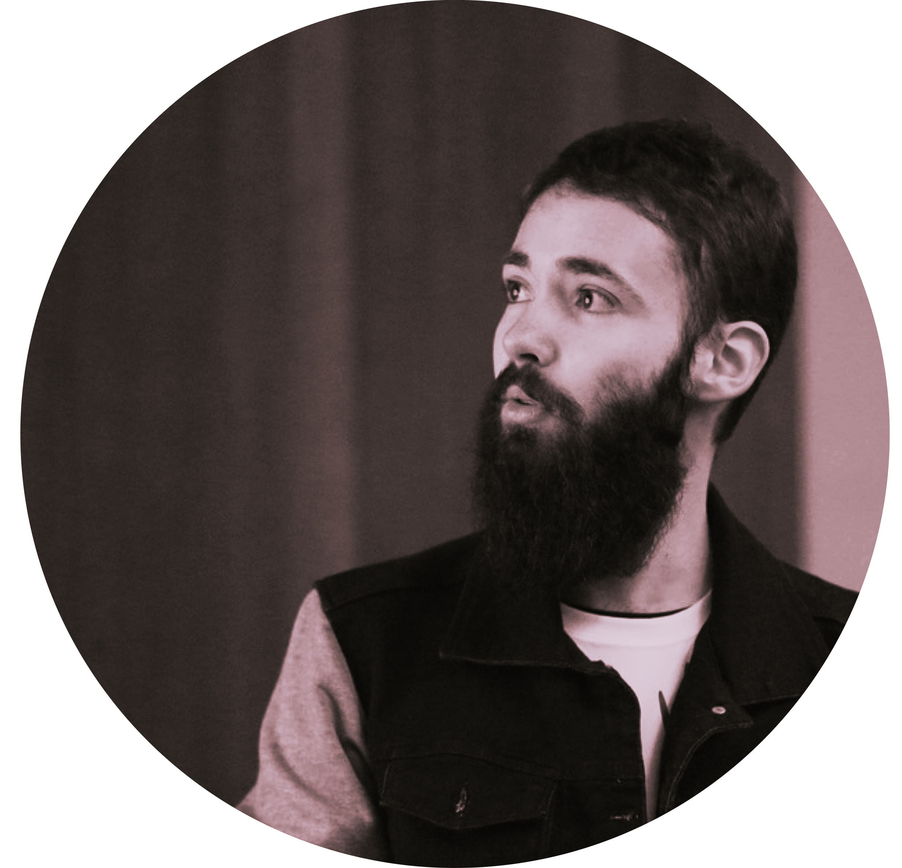

::: {layout="[1,2]"}

{width="30%"}

**Amabily Bohn | Pesquisadora e fundadora da DataChaos**
\
Sou bióloga, mestre em Botânica e doutora em Ecologia e Conservação pela Universidade Federal do Paraná. Minha trajetória na pesquisa passou pelo Inventário Florístico de Santa Catarina (FURB) e, atualmente, estou associada à Universidade Federal do Paraná como Pós-Doutoranda (Bolsista PDJ/CNPq) no PPG Botânica.
\
\
Minha trajetória é movida pela intersecção entre biologia, dados e tecnologia. Especialista em ecologia de comunidades e biogeografia, utilizo a linguagem R para realizar análises estatísticas complexas, modelagem de distribuição de espécies (SDMs) e visualização de dados espaciais. Como cofundadora da DataChaos, aplico o meu conhecimento para transformar dados em comunicações visuais precisas e impactantes.
\
<a href="https://scholar.google.com/citations?user=ualUrGcAAAAJ&hl=pt-BR" target="_blank" style="font-size: 1rem; color: #B86B2E;">
  <i class="bi bi-google"></i> Scholar
</a>

:::

::: {layout="[2,1]"}

**Marina Scalon | Pesquisadora e fundadora da DataChaos**
\
Sou Engenheira Florestal e mestre em Ecologia pela Universidade de Brasília, doutora pela Macquarie University (Australia). Fui pesquisadora em diversas instituições, incluindo University of Oxford (UK), e atualmente sou pesquisadora na Universidade Federal do Paraná. Meu trabalho une a ecologia de campo à robustez da análise de dados. Estudo a resiliência das plantas frente a estresses ambientais, e acredito na democratização da informação. Por isso, me dedico a transformar dados brutos em visualizações que não sejam apenas bonitas, mas que comuniquem resultados com precisão e clareza.
\
\
Domino ferramentas como R, Stan e linguagens de documentação dinâmica (Markdown, Quarto, LaTeX) e leciono programação e estatística na pós-graduação há mais de 10 anos, compartilhando não apenas meu conhecimento técnico, mas também meu entusiasmo pela ciência de dados e pela construção de uma pesquisa mais sólida e transparente.
\
<a href="https://mcscalon.github.io/" target="_blank" style="font-size: 1rem; color: #B86B2E;">
  <i class="bi-globe2"></i> Website
</a>
\
<a href="https://scholar.google.com/citations?user=mtJz9egAAAAJ&hl=en" target="_blank" style="font-size: 1rem; color: #B86B2E;">
  <i class="bi bi-google"></i> Scholar
</a>

:::

::: {layout="[1,2]"}

**Matheus Salles| Pesquisador e fundador da DataChaos**
\
Sou mestre e doutor em Zoologia pela Universidade Federal do Paraná (UFPR), onde também me graduei em Biologia (Bacharelado e Licenciatura). Minha atuação se concentra em Biologia Evolutiva, com ênfase em delimitação de espécies e no uso de inteligência artificial para investigar e resolver problemas biológicos diversos.
\
\
Também me dedico ao fortalecimento e à divulgação da Biologia Evolutiva no Brasil. Sou membro fundador da Sociedade Brasileira de Biologia Evolutiva e atuo como seu primeiro Diretor de Assuntos Estudantis, além de ter sido Embaixador da Rede Brasileira de Reprodutibilidade, organização voltada à promoção de práticas de ciência aberta e reprodutível no país.
\
\
Para além da pesquisa acadêmica, tenho forte interesse em comunicação científica, com experiência na produção, revisão e checagem de conteúdo para o público geral. Atualmente, atuo como Consultor Científico do TED, revisando roteiros para diferentes tipos de produções.
\
\
Tenho experiência com diferentes linguagens de programação (Julia, Python e R), aplicando-as à visualização e análise de dados em diferentes contextos da pesquisa em Biologia.
\
<a href="https://scholar.google.com/citations?user=STWZgBAAAAAJ&hl=pt-BR" target="_blank" style="font-size: 1rem; color: #B86B2E;">
  <i class="bi bi-google"></i> Scholar
</a>

:::
